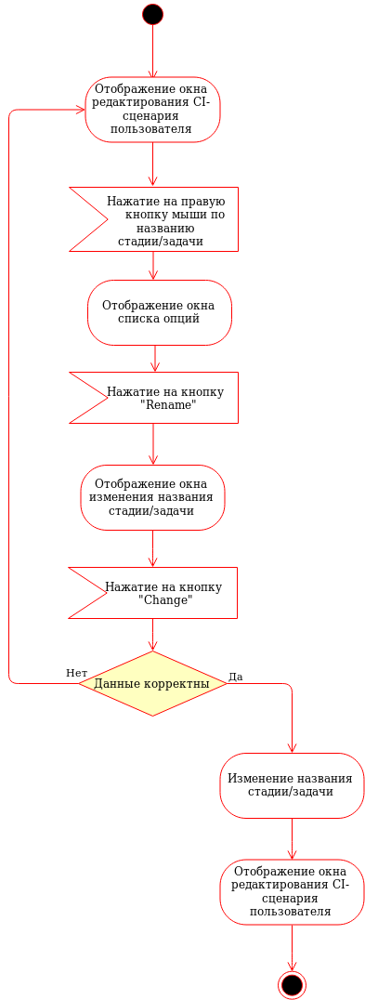
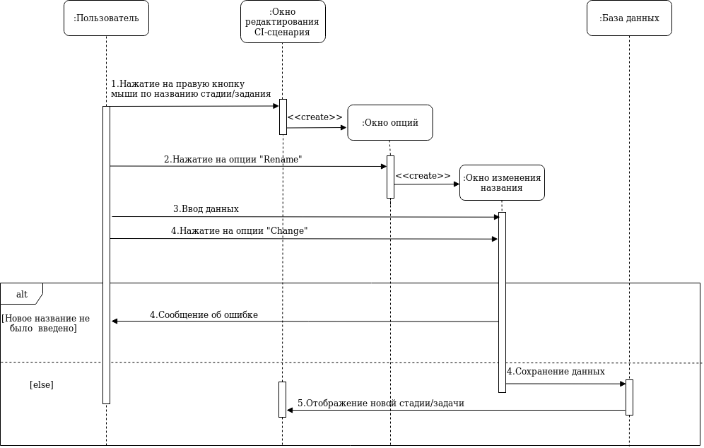
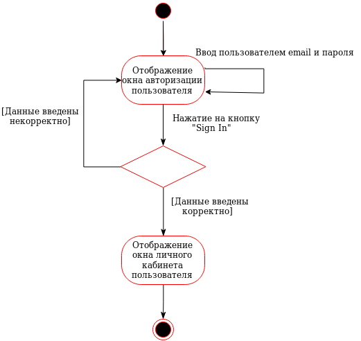

# Содержание

1. [Диаграмма вариантов использования](#1)  
1.1 [Актеры](#1.1)  
1.2 [Регистрация аккаунта](#1.2)  
1.3 [Авторизация](#1.3)  
1.4 [Отображение списка CI-сценариев](#1.4)  
1.5 [Поиск CI-сценария](#1.5)  
1.6 [Создание CI-сценария](#1.6)  
1.7 [Создание стадии/задачи CI-сценария](#1.7)  
1.8 [Переименование стадии/задачи CI-сценария](#1.8)  
1.9 [Удаление стадии/задачи CI-сценария](#1.9)  
1.10 [Сохранение изменений CI-сценария](#1.10)  
1.11 [Получение исходного CI-сценария](#1.11)  
1.12 [Выход из аккаунта](#1.12)  
2. [Диаграммы активности](#2)  
2.1 [Регистрация аккаунта](#2.1)  
2.2 [Авторизация](#2.2)  
2.3 [Отображение списка CI-сценариев](#2.3)  
2.4 [Поиск CI-сценария](#2.4)  
2.5 [Создание CI-сценария](#2.5)  
2.6 [Создание стадии/задачи CI-сценария](#2.6)  
2.7 [Переименование стадии/задачи CI-сценария](#2.7)  
2.8 [Удаление стадии/задачи CI-сценария](#2.8)  
2.9 [Сохранение изменений CI-сценария](#2.9)  
2.10 [Получение исходного CI-сценария](#2.10)  
2.11 [Выход из аккаунта](#2.11)  
3. [Диаграммы последовательности](#3)  
3.1 [Регистрация аккаунта](#3.1)  
3.2 [Авторизация](#3.2)  
3.3 [Отображение списка CI-сценариев](#3.3)  
3.4 [Поиск CI-сценария](#3.4)  
3.5 [Создание CI-сценария](#3.5)  
3.6 [Создание стадии/задачи CI-сценария](#3.6)  
3.7 [Переименование стадии/задачи CI-сценария](#3.7)  
3.8 [Удаление стадии/задачи CI-сценария](#3.8)  
3.9 [Сохранение изменений CI-сценария](#3.9)  
3.10 [Получение исходного CI-сценария](#3.10)  
4. [Диаграммы состояний](#4)  
4.1 [Регистрация аккаунта](#4.1)  
4.2 [Авторизация](#4.2)  
4.3 [Отображение списка CI-сценариев](#4.3)  
4.4 [Поиск CI-сценария](#4.4)  
4.5 [Создание CI-сценария](#4.5)  
4.6 [Создание стадии/задачи CI-сценария](#4.6)  
4.7 [Удаление стадии/задачи CI-сценария](#4.7)  

# 1. Диаграмма вариантов использования 

  

## 1.1 Актеры  
Актёр | Описание
--- | ---
Пользователь|Пользователь, имеющий возможность произвести регистрацию аккаунта пользователя и авторизацию. Не имеет доступа к функционалу веб-приложения.
Авторизованный пользователь|Пользователь, имеющий доступ к полному функционалу приложения.
## 1.2 Регистрация аккаунта  

**Описание**. Вариант использования "**Регистрация аккаунта**" позволяет пользователю зарегистрировать свой аккаунт в веб-приложении.  
 Поток событий:  
    1. Пользователь попадает на окно регистрации аккаунта пользователя.  
    2. Пользователь вводит "Логин", "E-mail", "Пароль".  
    3. Пользователь нажимает клавишу "Sign up".  
    4. Веб-приложение производит валидацию и проверяет уникальность данных.  
    5. При возникновении ошибки веб-приложение показывает сообщение об ошибке и пользователь повторяет действия начиная с пункта 2.  
    6. Веб-приложение добавляет нового пользователя.  
    7. Веб-приложение отображает окно с личным кабинетом пользователя.  
    8. Конец.  

## 1.3 Авторизация  
**Описание**. Вариант использования "**Авторизация**" позволяет пользователю авторизироваться в веб-приложении.  
 Поток событий:  
    1. Пользователь попадает на окно авторизации.  
    2. Пользователь вводит "E-mail", "Пароль".  
    3. Пользователь нажимает клавишу "Sign in".  
    4. Веб-приложение производит валидацию.  
    5. При возникновении ошибки веб-приложение показывает сообщение об ошибке и пользователь повторяет действия начиная с пункта 2.  
    6. Веб-приложение добавляет нового пользователя.  
    7. Конец.  

## 1.4 Отображение списка CI-сценариев  

**Описание**. Вариант использования "**Отображение списка CI-сценариев**" позволяет пользователю видеть весь список созданных CI-сценариев.  
 Поток событий:  
    1. Пользователь попадает на окно личного кабинета пользователя.  
    2. Веб-приложение получает список всех созданных CI-сценариев.  
    3. Веб-приложение производит отображение списка созданных CI-сценариев если он не пустой, иначе пустого списка.  
    4. Конец.  

## 1.5 Поиск CI-сценария  

**Описание**. Вариант использования "**Поиск CI-сценария**" позволяет пользователю производить поиск CI-сценария.  
 Поток событий:  
    1. Пользователь попадает на окно личного кабинета пользователя.  
    2. Пользователь вводит название CI-сценария, по которому хочет осуществить поиск.  
    3. Веб-приложение производит поиск по введенному названию CI-сценария.  
    4. Веб-приложение производит отображение CI-сценария если он была найден, иначе пустого списка CI-сценариев.  
    5. Конец.  

## 1.6 Создание CI-сценария  

**Описание**. Вариант использования "**Создание CI-сценария**" позволяет пользователю создавать CI-сценарий.  
 Поток событий:  
    1. Пользователь попадает на окно личного кабинета пользователя.  
    2. Пользователь нажимает на кнопку "Add".  
    3. Веб-приложение отображает форму для ввода названия нового CI-сценария.  
    4. Пользователь вводит название для нового CI-сценария.  
    5. Пользователь нажимает на кнопку "Create".  
    6. Веб-приложение производит валидацию введенных данных, если ничего не было введено пользователь повторяет действия с пункта 2.  
    7. Веб-приложение создает и отображает новый CI-сценарий.  
    8. Конец.  

## 1.7 Создание стадии/задачи CI-сценария  

**Описание**. Вариант использования "**Создание стадии/задачи CI-сценария**" позволяет пользователю создавать стадии/задачи CI-сценарий.  
 Поток событий:  
    1. Пользователь попадает на окно редактирования выбранного CI-сценария.  
    2. Пользователь нажимает на кнопку "New Stage/New Task".  
    3. Веб-приложение отображает форму для ввода названия новой стадии/задачи CI-сценария.  
    4. Пользователь вводит название для нового CI-сценария.  
    5. Пользователь нажимает на кнопку "Create".  
    6. Веб-приложение производит валидацию введенных данных, если ничего не было введено пользователь повторяет действия с пункта 2.  
    7. Веб-приложение создает и отображает новую стадию/задачу CI-сценария.  
    8. Конец.  

## 1.8 Переименование стадии/задачи CI-сценария  

**Описание**. Вариант использования "**Переименование стадии/задачи CI-сценария**" позволяет пользователю переименовать стадию/задачу CI-сценария.  
 Поток событий:  
    1. Пользователь попадает на окно редактирования выбранного CI-сценария.  
    2. Пользователь нажимает на правую кнопку мыши по названию стадии/заданию CI-сценария.  
    3. Веб-приложение отображает окно опций для выбора необходимой опции.  
    4. Пользователь нажимает на опцию "Rename".  
    5. Веб-приложение отображает форму для ввода нового названия для стадии/задачи CI-сценария.  
    6. Веб-приложение производит валидацию введенных данных.  
    7. Веб-приложение изменяет и отображает стадию/задачу CI-сценария.  
    8. Конец.  

## 1.9 Удаление стадии/задачи CI-сценария  

**Описание**. Вариант использования "**Удаление стадии/задачи CI-сценария**" позволяет пользователю удалять стадии/задачи CI-сценария.  
 Поток событий:  
    1. Пользователь попадает на окно редактирования выбранного CI-сценария.  
    2. Пользователь нажимает на правую кнопку мыши по названию стадии/заданию CI-сценария.  
    3. Веб-приложение отображает окно опций для выбора необходимой опции.  
    4. Пользователь нажимает на опцию "Remove".  
    5. Веб-приложение удаляет и отображает обновленный список стадий/задач CI-сценария.  
    6. Конец.  

## 1.10 Сохранение изменений CI-сценария  

**Описание**. Вариант использования "**Сохранение изменений CI-сценария**" позволяет пользователю сохранять изменения произведенные над CI-сценарием.  
 Поток событий:  
    1. Пользователь попадает на окно редактирования выбранного CI-сценария.  
    2. Пользователь нажимает кнопку "Save".  
    3. Веб-приложение сохраняет изменения произведенные над CI-сценарием.  
    4. Конец.  

## 1.11 Получение исходного CI-сценария  

**Описание**. Вариант использования "**Получение исходного CI-сценария**" позволяет пользователю получить исходный CI-сценарий.  
 Поток событий:  
    1. Пользователь попадает на окно редактирования выбранного CI-сценария.  
    2. Пользователь нажимает кнопку "Export".  
    3. Веб-приложение производит сохранение изменений и формирования файла CI-сценария.  
    4. Веб-приложение производит отправку файла CI-сценария пользователю.  
    5. Конец.  

## 1.12 Выход из аккаунта  

**Описание**. Вариант использования "**Выход из аккаунта**" позволяет пользователю получить исходный CI-сценарий.  
 Поток событий:  
    1. Пользователь нажимает на кнопку выпадающего меню.  
    2. Веб-приложение производит отображение выпадающего меню.  
    3. Пользователь нажимает на кнопку "Log out".  
    4. Веб-приложение отображает окно авторизации.  
    5. Конец.  

# 2. Диаграммы активности 

## 2.1 Регистрация аккаунта 
  
## 2.2 Авторизация 
  
## 2.3 Отображение списка CI-сценариев 
  
## 2.4 Поиск CI-сценария 
  
## 2.5 Создание CI-сценария 
  
## 2.6 Создание стадии/задачи CI-сценария 
  
## 2.7 Переименование стадии/задачи CI-сценария 
  
## 2.8 Удаление стадии/задачи CI-сценария 
  
## 2.9 Сохранение изменений CI-сценария 
  
## 2.10 Получение исходного CI-сценария 
  
## 2.11 Выход из аккаунта 
  

# 3. Диаграммы последовательности 

## 3.1 Регистрация аккаунта 
  
## 3.2 Авторизация 
  
## 3.3 Отображение списка CI-сценариев 
  
## 3.4 Поиск CI-сценария 
  
## 3.5 Создание CI-сценария 
  
## 3.6 Создание стадии/задачи CI-сценария 
  
## 3.7 Переименование стадии/задачи CI-сценария 
  
## 3.8 Удаление стадии/задачи CI-сценария 
  
## 3.9 Сохранение изменений CI-сценария 
  
## 3.10 Получение исходного CI-сценария 
  

# 4. Диаграммы состояний 

Данные диаграммы были созданы на основании следующих Mockup's:  
* [Окно регистрации](https://github.com/Andrew304/Visual-CI-Manager/blob/master/Mockup's/Sign_Up_Page.png)  
* [Окно авторизации](https://github.com/Andrew304/Visual-CI-Manager/blob/master/Mockup's/Sign_In_Page.png)  
* [Окно личного кабинета пользователя](https://github.com/Andrew304/Visual-CI-Manager/blob/master/Mockup's/All_CI_Page.png)  
* [Окно редактирования](https://github.com/Andrew304/Visual-CI-Manager/blob/master/Mockup's/Edit_Page.png)  

## 4.1 Регистрация аккаунта 
  
## 4.2 Авторизация 
  
## 4.3 Отображение списка CI-сценариев 
  
## 4.4 Поиск CI-сценария 
  
## 4.5 Создание CI-сценария 
  
## 4.6 Создание стадии/задачи CI-сценария 
  
## 4.7 Удаление стадии/задачи CI-сценария 
  
