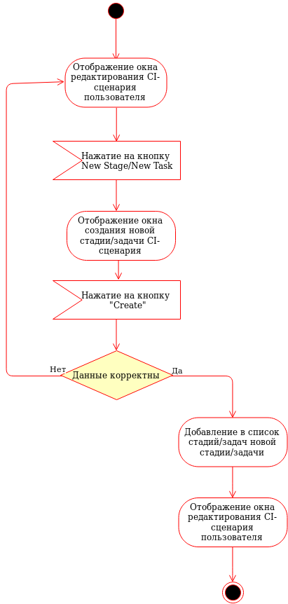
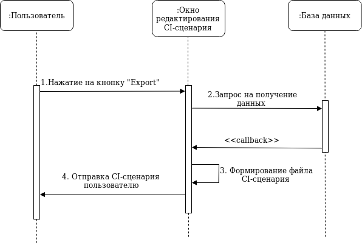

# Содержание

1. [Диаграмма вариантов использования](#1)  
2. [Диаграммы активностей](#2)  
2.1 [Регистация аккаунта](#2.1)  
2.2 [Авторизация](#2.2)  
2.3 [Отображение списка CI-сценариев](#2.3)  
2.4 [Поиск CI-сценария](#2.4)  
2.5 [Создание CI-сценария](#2.5)  
2.6 [Создание стадии/задачи CI-сценария](#2.6)  
2.7 [Переименование стадии/задачи CI-сценария](#2.7)  
2.8 [Удаление стадии/задачи CI-сценария](#2.8)  
2.9 [Сохранение изменений CI-сценария](#2.9)  
2.10 [Получение исходного CI-сценария](#2.10)  
2.11 [Выход из аккаунта](#2.11)  
3. [Диаграммы последовательности](#3)  
3.1 [Регистация аккаунта](#3.1)  
3.2 [Авторизация](#3.2)  
3.3 [Отображение списка CI-сценариев](#3.3)  
3.4 [Поиск CI-сценария](#3.4)  
3.5 [Создание CI-сценария](#3.5)  
3.6 [Создание стадии/задачи CI-сценария](#3.6)  
3.7 [Переименование стадии/задачи CI-сценария](#3.7)  
3.8 [Удаление стадии/задачи CI-сценария](#3.8)  
3.9 [Сохранение изменений CI-сценария](#3.9)  
3.10 [Получение исходного CI-сценария](#3.10)  

# 1. Диаграмма вариантов использования 

  

# 2. Диаграммы активностей 

## 2.1 Регистация аккаунта 
  
## 2.2 Авторизация 
  
## 2.3 Отображение списка CI-сценариев 
  
## 2.4 Поиск CI-сценария 
  
## 2.5 Создание CI-сценария 
  
## 2.6 Создание стадии/задачи CI-сценария 
  
## 2.7 Переименование стадии/задачи CI-сценария 
  
## 2.8 Удаление стадии/задачи CI-сценария 
  
## 2.9 Сохранение изменений CI-сценария 
  
## 2.10 Получение исходного CI-сценария 
  
## 2.11 Выход из аккаунта 
  
# 3. Диаграммы последовательности 
## 3.1 Регистация аккаунта 
  
## 3.2 Авторизация 
  
## 3.3 Отображение списка CI-сценариев 
  
## 3.4 Поиск CI-сценария 
  
## 3.5 Создание CI-сценария 
  
## 3.6 Создание стадии/задачи CI-сценария 
  
## 3.7 Переименование стадии/задачи CI-сценария 
  
## 3.8 Удаление стадии/задачи CI-сценария 
  
## 3.9 Сохранение изменений CI-сценария 
  
## 3.10 Получение исходного CI-сценария 
  