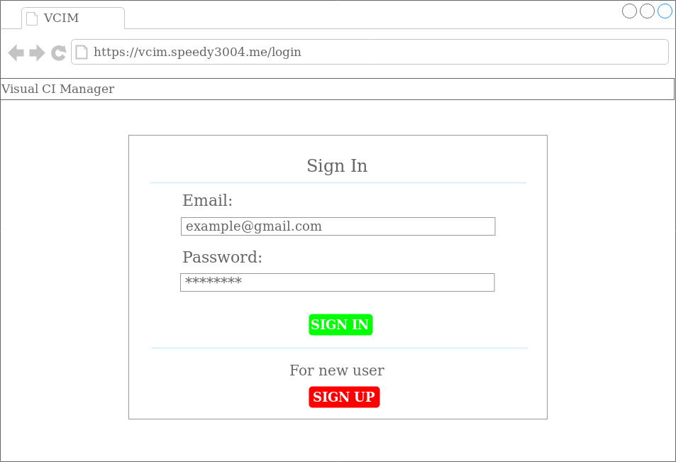
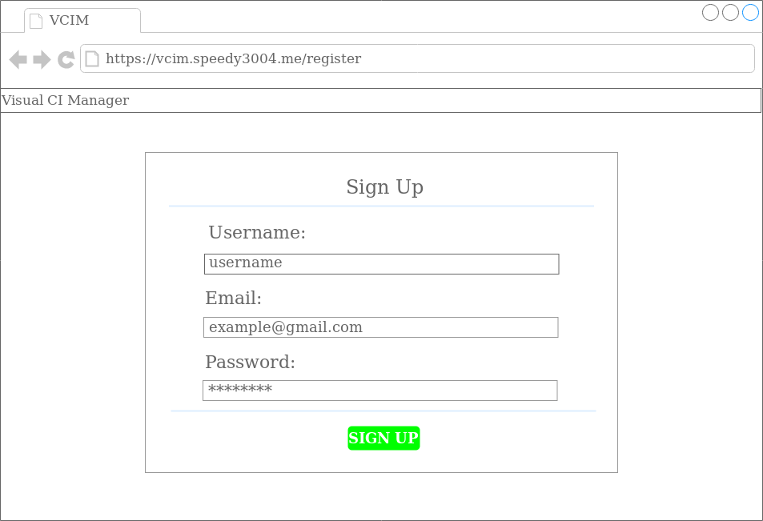
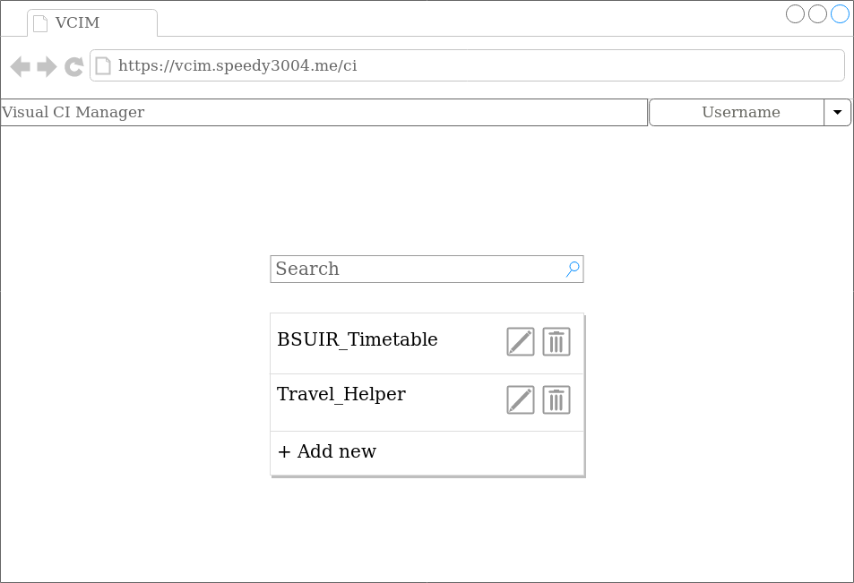
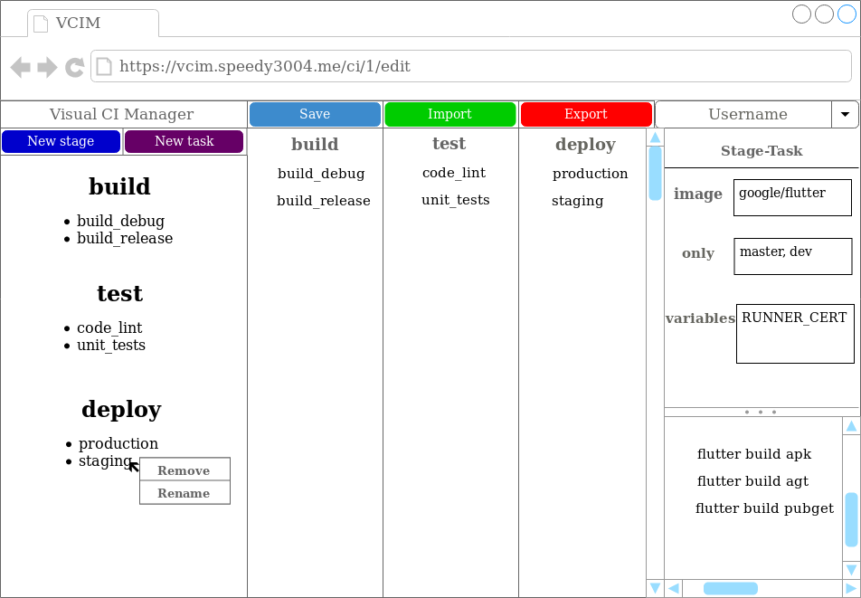

# Software requirements specification
***
# Содержание
1. [Введение](#1)  
1.1 [Назначение](#1.1)  
1.2 [Границы проекта](#1.2)  
1.3 [Аналоги](#1.3)  
2. [Требования пользователя](#2)  
2.1 [Программные интерфейсы](#2.1)  
2.2 [Интерфейс пользователя](#2.2)  
2.3 [Характеристики пользователей](#2.3)  
2.3.1 [Аудитория](#2.3.1)  
3. [Системные требования](#3)  
3.1 [Функциональные требования](#3.1)  
3.1.1 [Основные функции](#3.1.1)  
3.1.1.1 [Регистрация аккаунта пользователя](#3.1.1.1)  
3.1.1.2 [Вход пользователя](#3.1.1.2)  
3.1.1.3 [Отображение CI-сценариев пользователя](#3.1.1.3)  
3.1.1.4 [Поиск CI-сценария пользователя по названию](#3.1.1.4)  
3.1.1.5 [Создание CI-сценария пользователя](#3.1.1.5)  
3.1.1.6 [Редактирование CI-сценария пользователя](#3.1.1.6)  
3.1.1.7 [Удаление CI-сценария пользователя](#3.1.1.7)  
3.2 [Нефункциональные требования](#3.2)  
3.2.1 [Атрибуты качества](#3.2.1)  
3.2.1.1 [Требования к удобству использования](#3.2.1.1)  
3.2.1.2 [Требования к безопасности](#3.2.1.2)  
3.2.1.3 [Требования к надежности](#3.2.1.3)  
3.2.2 [Внешние интерфейсы](#3.2.2)
***
# 1. Введение 

В данном документе приведен обзор веб-приложения "Visual CI Manager" и список требований, которым должно удовлетворять данное приложение.

## 1.1 Назначение 
При стандартном подходе (каскадная разработка ПО или Waterfall-методика), где разработчики независимо трудятся над разными частями системы, стадия интеграции является заключительной, и при выявлении ошибок может непредсказуемо задержать окончание работ. Переход к непрерывной интеграции(CI) позволяет снизить трудоёмкость работы и сделать её более предсказуемой за счёт раннего и непрерывного обнаружения и устранения ошибок и противоречий.

Принцип действия CI похож на конвейер: методика выполняет интеграционную функцию, включая различные типы автоматических тестов на каждом этапе, с последующей доставкой и развёртыванием завершённого кода в готовый продукт для конечного пользователя.

Веб-приложение "Visual CI Manager" предназначено для автоматизации процесса визуального создания и изменения CI-сценариев.

## 1.2 Границы проекта 
Приложение предоставляет возможности визуального создания, изменения и удаления CI-сценариев.

## 1.3 Аналоги 

В ходе исследования аналогов обнаружено не было.

# 2. Требования пользователя 

## 2.1 Программные интерфейсы 

Для реализации веб-приложения будут использоваться следующие технологии - язык программирования Python, фреймворк Django для реализации логики работы веб-приложения, JavaScript - скриптовый язык, который будет использоваться с целью обработки взаимодействия пользователя с интерфейсом.

## 2.2 Интерфейс пользователя 
Для начала работы с веб-приложением "Visual CI Manager" пользователю необходимо произвести авторизацию. Для этого пользователю будет предоставлена форма, которую необходимо заполнить личными индентификационными данными и произвести вход.  

  

При отсутствии у пользователя аккаунта ему необходимо его создать. Для этого пользователю будет предоставлена форма регистрации.  

  

После успешной авторизации пользователя, в его личном кабинете будет располагаться список созданных им CI-сценариев. Также пользователю будут предоставлены возможности поиска, создания, выбора для редактирования и удаления CI-сценария.  

  

Если пользователем будет осуществлен выбор определенного CI-сценария он попадет в окно редактирования. В котором он будет производить все необходимые настройки для CI-сценария и по завершению редактирования сможет получить исходный файл CI-сценария.

  

## 2.3 Характеристики пользователей 

## 2.3.1 Аудитория 
Аудиторией данного веб-приложения являются технические специалисты, использующие DevOps инструменты.

# 3. Системные требования 

## 3.1 Функционал требования 

### 3.1.1 Основные функции 

#### 3.1.1.1 Регистрация аккаунта пользователя 
Если у пользователя нет аккаунта веб-приложения, то для получения доступа к основным функциям веб-приложения, он должен произвести регистрацию аккаунта пользователя. При регистрации веб-приложение должно запросить у пользователя логин, email и пароль для создания аккаунта.

#### 3.1.1.2 Вход пользователя 
Пользователь должен использовать зарегистрированный аккаунт для входа в веб-приложение. Веб-приложение должно запросить у пользователя email и пароль для входа в аккаунт. При успешной авторизации веб-приложение должно предоставить доступ к своему полному функционалу, а при ошибке авторизации сообщить об этом пользователю.

#### 3.1.1.3 Отображение CI-сценариев пользователя 
Для авторизованного пользователя веб-приложение должно отображать CI-сценарии в виде списка их названий.

#### 3.1.1.4 Поиск CI-сценария пользователя по названию 
Для авторизованного пользователя веб-приложение должно предоставлять возможность поиска CI-сценария по названию. После ввода названия CI-сценария пользователем, в случае успеха, в списке будет отображен запрошенный CI-сценарий, иначе пользователю будет отображен пустой список CI-сценариев.

#### 3.1.1.5 Создание CI-сценария пользователя 
Для авторизованного пользователя веб-приложение должно предоставлять возможность для создания нового CI-сценария и сохранения его в список CI-сценариев пользователя.

#### 3.1.1.6 Редактирование CI-сценария пользователя 
Для авторизованного пользователя веб-приложение должно предоставлять графический интерфейс для редактирования CI-сценария, который включает в себя: создание и удаление стадий и задач, перенесение задач в определенные стадии, сохранение изменений и получение исходного кода CI-сценария на основе сделанных изменений.

#### 3.1.1.7 Удаление CI-сценария пользователя 
Для авторизованного пользователя веб-приложение должно предоставлять возможность выбора CI-сценария, который будет удален.

## 3.2 Нефункциональные требования 

### 3.2.1 Атрибуты качества 

#### 3.2.1.1 Требования к удобству использования 
В веб-приложении должен использоваться интуитивно понятный пользователю интерфейс, а именно интерфейс должен быть распознан и понятен инстинктивно и естественно, за счет использования элементов интерфейса, которые пользователь мог видеть и использовать ранее. Информация, которой оперирует приложение, не должна иметь двухсмысленных значений.

#### 3.2.1.2 Требования к безопасности 
Доступ к функционалу веб-приложения предоставляется только авторизированным пользователям.

#### 3.2.1.3 Требования к надежности 
Веб-приложение должно выполнять поставленные задачи и обеспечивать сохранность данных, с которыми работает пользователь, также приложение должно корректно обрабатывать непредвиденные действия со стороны пользователя.

### 3.2.2 Внешние интерфейсы 
Окна приложения удобны для использования пользователем:  
+ Хорошо читаемый, адаптированный под разные экраны шрифт.  
+ Цветовое оформление сбалансировано и функциональные элементы отчетливо отображаются на общем фоне.
